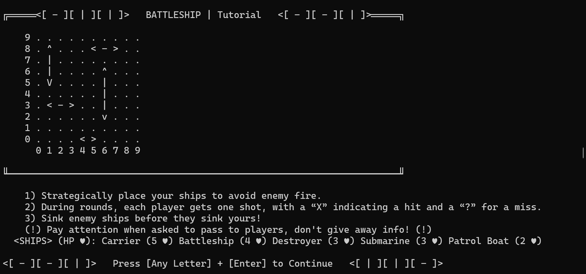

# <[ - ][ | ][ | ]> _BattleShip_ <[ - ][ - ][ | ]>

## Console based game replication of Hasbro’s classic board game _BattleShip_ 

## How to Play
1. Decide which player is Player 1 and Player 2.
2. Strategically place your ships to avoid enemy fire in the ship placement phase.
3. During rounds, each player gets one shot, with a “X” indicating a hit and a “?” for a miss; players will also get the chance to see the status of their own ships and their healths before attacking.
4. Sink all enemy ships before they sink yours to win!

## Features
1. Aesthetically pleasing console interface
2. Robust input validation and error messaging (invalid ship placements, duplicate target attempts, etc.)
3. The four classic "boards" and all other "screens" represented by dynamically allocated 2D arrays
4. Individual ship tracking; individual ship health ♥ and positioning stored through use of structs

## Gameplay Screenshots

 
